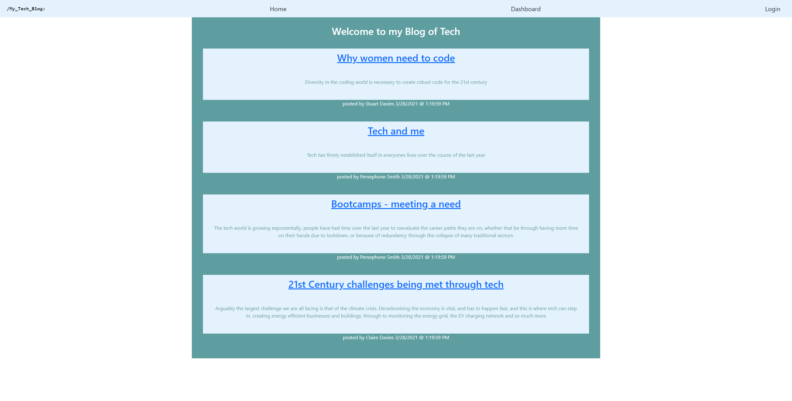

# Tech Blog   

## Description
Creating an end to end blog page from scratch.  Allowing users to register and post content, as well as update and delete their own posts.  

## Table of Contents
  - [Tech Blog](#Tech-Blog)
  - [Description](##description)
  - [Table of Contents](##table-of-contents)
  - [Installation](##installation)
  - [Usage](##usage)
  - [License](##license)
  - [Contributors](##contributors)
  - [Technologies Used](##technologies-used)
  - [Future versions](##future-versions)

## Installation
It can be run locally from the github repository, once packages are installed and the database is created and seeded from the enclosed seed files and schema.  It is also deployed live at heroku. 

## Usage
Blog posts can be submitted and commented on once the user is registered.  The user can come back to the site at a later date and login to continue where they left off.  

The live deployed site is found at: https://obscure-escarpment-55372.herokuapp.com/

A screenshot 

## License
License with MIT

## Contributors
This app is the sole work of [Claire Davies](https://github.com/ClaireMDavies)

## Technologies Used
- Javascript
- node.js
- sequelize npm
- mySQL2 npm
- dotenv
- express npm
- mySQL Workbench
- bcrypt npm
- express-session npm
- connect-session-sequelize npm
- heroku
- express-handlebars npm
- html
- css
- bootstrap
- jquery
  
    

## Future versions
There is great scope for this project, and many updates could make it a more complete package, such as:  

- making the UX of the text fields better, thereby allowing the user to move around the blog post more easily, especially when they come to edit it.  
- adding an option for images
- ...and much more

 
  